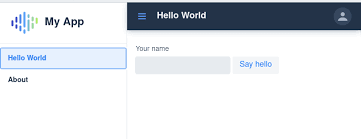

#  AILegorreta-kit-client-navigation

This repository contains the source code for Vaadin standard navigation in `Vaaadin flow` (same look & feel) 
in `Vaadin Hilla` but it is programmed in typescript, see a Vaadin Hilla front end ad an
example) that are utilize from any front end `Vaadin flow` UI microservices.
`ailegorreta-kit-client-navigator` is created as a separate framework in order to avoid
repeating code and also to simplify maintenance.

The purpose of this java package is to minimize development time, simplify maintenance for the Ai marketplace by
LegoSoft Soluciones, S.C. and keep the navigation as a unique look&feel standard. This
generic package can also can be imported by any Clients system but the
©Copyright it is still owned by LegoSoft Soluciones, S.C.. The Customer can use these packages and copy them
as many times as he(she) likes, inside his(her) Company only.

## What is it?

The `ailegorreta-kit-clients-navigator` is documented in a separate file inside the
`document` directory for `ailegorreta-kit-client` parent project.

### Contact AI Legorreta

Feel free to reach out to AI Legorreta on [web page](https://legosoft.com.mx).

Version: 2.0
©LegoSoft Soluciones, S.C., 2023
