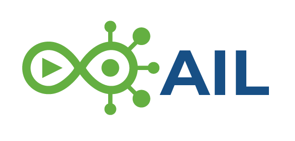
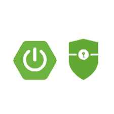

#  AILegorreta-kit-client-security

This repository contains the source code for all libraries (java packages) that are imported to use the Spring 
Security client credentials for any microservices (without Vaadin framework).
`ailegorreta-kit-commons-security` is a package for any microservice in order to avoid repeating code and
also to simplify maintenance.

The purpose of this java package is to minimize development time, simplify maintenance for the Ai marketplace by
LegoSoft Soluciones, S.C. These are generic packages that also can be imported by any Clients system but the
©Copyright it is still owned by LegoSoft Soluciones, S.C.. The Customer can use these packages and copy them
as many times as he(she) likes, inside his(her) Company only.
## What is it?

The `ailegorreta-kit-commons-security` is a set of generic classes that are needed to implement Spring Security
for any microservices that utilize Vaadin (i.e., `ailegorreta-kit-client-security`, and 
microservices that NOT utilize Vaadin framework like `gateway-service` (that it is not necessary a front-end UI 
microservice)

## Additional documentation

See the `documentation` directory for instructions on how to generate SPA application with
the SSO concept for PWAs.

## Future improvements:

Since this is continuous work the following development activities are in process (June 2023):

| Activity   | Comment                                                       |
|------------|---------------------------------------------------------------|
| `keycloak` | Add Keycloak support instead of Spring Authoriation Server.   |

### Contact AI Legorreta

Feel free to reach out to AI Legorreta on [web page](https://legosoft.com.mx).

Version: 2.0
©LegoSoft Soluciones, S.C., 2023
