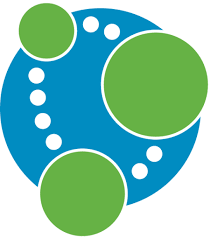

#  AILegorreta-kit-data-neo4j

This repository contains the source code for all libraries (java packages) that are imported from any microservice that
needs some data persistence access to a graph Neo4j database
`ailegorreta-kit-data-neo4j` has packages for access for Neo4j graph database in
order to avoid repeating code and also to simplify maintenance.

The purpose of these java packages are to minimize development time, simplify maintenance for the Ai marketplace by
LegoSoft Soluciones, S.C. These are generic packages that also can be imported by any Clients system but the
©Copyright it is still owned by LegoSoft Soluciones, S.C.. The Customer can use these packages and copy them
as many times as he(she) likes, inside his(her) Company only.
## What is it?

The `ailegorreta-kit-data-neo4j` is a set of generic classes that can be utilized for a different microservices.
The objective is to reduce code repetition.

The supported databases are:

* Neo4j version 4.x

TODO: future version will be updated to Neo4j 5.X

## History of ailegorreta-kit-data-neo4j

### Version 1.X

For this version we use everything for docker desktop environment.

### Version 2.X

The main functionality was kept the same. The main difference is to migrate the Desktop on-premise
platform to a Cloud Native Kubernetes platform.

## Future improvements:

Since this is continuous work the following development activities are in process (June 2023):

| Activity         | Comment                                  |
|------------------|------------------------------------------|
| `upgrade to 5.x` | Upgrade Neo4j 4.x to newest version 5.x. |

### Contact AI Legorreta

Feel free to reach out to AI Legorreta on [web page](https://legosoft.com.mx).

Version: 2.0
©LegoSoft Soluciones, S.C., 2023
