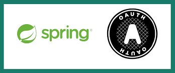

#  AILegorreta-kit-resource-server-security

This repository contains the source code for all libraries (java packages) that are imported from any microservices for
the back-end that utilize Spring security. `ailegorreta-kit-resource-server-security` is a packages for Spring
Security, i.e., `Spring Authorization-Server`.

The purpose of these java packages are to minimize development time, simplify maintenance for the Ai marketplace by
LegoSoft Soluciones, S.C. These are generic packages that also can be imported by any Clients system but the
©Copyright it is still owned by LegoSoft Soluciones, S.C.. The Customer can use these packages and copy them
as many times as he(she) likes, inside his(her) Company only.
## What is it?

The `ailegorreta-kit-resource-server-security` is a set of generic classes that can be utilized for a back-end
microservice that needs to be protected.

## Information:

For more information visit Spring Security and Spring Authorization Server.

The microservice that acts as the token producer is the `auth-service`.

### Contact AI Legorreta

Feel free to reach out to AI Legorreta on [web page](https://legosoft.com.mx).

Version: 2.0
©LegoSoft Soluciones, S.C., 2023
